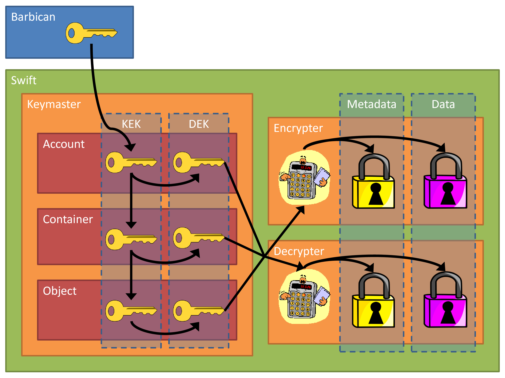

Swift-KeyRotate middleware and client
=====================================

Swift-KeyRotate provides hierarchical key management for use with encryption of data at rest within OpenStack Swift object storage.
This repository consists of two components:

-  swift/: Middleware for use within the Swift proxy server
-  python-swiftclient:/ A modified python client for the Swift API, with added support for the new key management operations

The keymaster middleware performs key-management tasks and provides encryption keys for other middleware, in particular for the encryption middleware.
The encryption middleware encrypts and decrypts user and system metadata, as well as the actual user data that is stored in the Swift object storage system.

Swift Key Rotate middleware
---------------------------

Structure
~~~~~~~~~

Swift organizes and manages data in terms of accounts, containers and objects.
The keymaster abstracts Swift accounts, containers, and objects as Entity objects.
Swift objects belong to containers, and containers belong to accounts.
Swift users authenticate to the system using a different service such as OpenStack Keystone, and Swift requests identify the requests as belonging to a certain account, and possibly also to a container and an object.
Which keys need to be retrieved, created and/or provisioned by the keymaster depends on the type of Entity that the request operates on.
Our keymaster operates on Entities, which contain key-encryption keys (KEKs), data encryption keys (DEKs), and the ID of the parent Entity whose KEK is used to wrap the current Entity’s KEK, as shown in the figure below.

The KEKs are only used internally in the keymaster to wrap other KEKs, as well as DEKs.
The DEKs are provided to other middleware, in particular to the decrypter and encrypter middlewares, which in turn use the DEKs to decrypt and encrypt user and system
metadata, as well as user data.

The figure shows the top-level Master key stored in Barbican, and the Master key is used to wrap the Account KEK.
The Account KEK is used to wrap both the corresponding Account DEK, as well as the Container KEK.
In the same way, the Container KEK is used to wrap the Container DEK and the Object KEK, and finally the Object KEK is used to wrap the Object DEK.
The master key(s) are generated by and stored in Barbican.
The requests for generating the keys and storing them in Barbican are sent by the user directly to Barbican.
The swift keymaster retrieves the user’s keys from Barbican using the user’s authentication token, which is passed in with regular Swift requests.
The fact that the user’s authentication token is required for accessing the keys from Barbican means that any key management operation that requires access to the master keys from Barbican, can only be performed as part of a user request, and e.g., not as regularly scheduled background tasks.

Key Rotation and Secure Deletion
~~~~~~~~~~~~~~~~~~~~~~~~~~~~~~~~

According to commonly accepted security practice, encryption keys must be periodically rotated, for various reasons that are best described in the relevant guidelines of NIST [1, 2, 3].
Industry has supported this requirement through systems for key-lifecycle management [4].
As a first step only the key at the top level (the account key) could be rotated. But this provides only partial protection because an adversary could have locally stored some key that lies below the account key in the hierarchy.
This would allow access to all underlying data.
Instead, in the design described here, key rotation is performed on all levels; this is necessary, among other reasons, for supporting secure cryptographic deletion.
For cryptographically deleting an object o, all the parent KEKs of the object to be deleted are rotated (e.g., its container key, the account key, and the master key), and then all the KEKs whose parent KEK changed are re-wrapped.
Once the old master key is securely deleted in the KLMS, the object o will be cryptographically deleted, i.e., the encrypted data might still be accessible, but the DEK required to decrypt the data might no longer be available.
(Obviously the adversary could have simply stored a copy of the plaintext data to be securely deleted; this is an attack that cannot be prevented, therefore it is not considered in this design.)

The figures below show the key rotation process when securely deleting an object and a container, respectively.
The initial state is shown as yellow keys - in both figures, there are two containers, C1 and C2, each containing two objects, O11 and O12 in container C1, and O21 and O22 in container C2.

The new, re-keyed keys are shown in red, and old keys that are deleted as part of the key rotation process as shown with red X symbols.
In the figure above, the user wants to delete the object O22, corresponding to the KEK O22 K1.
The Swift delete operation may already have been executed, in which case the object data is no longer accessible through the regular Swift APIs, but low-level access to the physical storage medium may still reveal the encrypted data of the deleted object.
As long as the keys needed to decrypt the object exist, from the Swift encryption body key, to the DEKs and KEKs of the key hierarchy all the way up to the master KEK, it may be possible for an attacker to recover the data.
To securely delete the data, one or more keys in the key hierarchy shall be securely deleted.
To this end, key rotation is performed, where the keys for the entities that are to be kept are rotated, while the keys for the entities that are to be securely deleted are not rotated.
When securely deleting object O22 in the figure above, the KEKs of the parent container C1 and the account, as well as the master key, are re-keyed.
Subsequently, the KEKs of all entities whose parent KEKs have changed, are rewrapped with the new parent key.
In this case, the KEK of object O21 is rewrapped with the new container key C2 K2, and the KEK of container C1 is rewrapped with the new account key AK2.
Once the old keys are purged from the system, the object O22 is effectively cryptographically deleted.
The other object in container C2 can still be accessed using its old KEK O21 K1, and the other container C1 can still be accessed using its old KEK C1K1.

The figure above shows a similar scenario, but here the user wants to securely delete an entire container C2, instead of just a single object within the container.
In this case, the KEKs of all parent entities of the container C2 are re-keyed, i.e., AK1 and MK1, and the KEKs of all entities whose parent KEK has changed are re-wrapped, i.e., container C1.
Once the old keys are deleted, up to and including the old master key MK1, the container C2, including all objects stored within the container, are securely deleted.

Performance-wise the key rotation process can be quite expensive, and when deleting multiple objects it may be desirable to postpone the key rotation until all objects in the current deletion batch have been removed.
Another argument for delaying the key rotation process is to implement a "grace period", where a user has a possibility to undo the delete operations within a certain period of time, e.g., a day, before the operation is committed by performing key rotation.
To support the above scenarios, it is possible to decouple the deletion operation from the key rotation process, and perform them separately.
Objects and container can then be deleted using the regular delete operations, which do not involve any key rotation.
Once the operations are to be committed, the user performs a key rotation on the parent entities of all entities that have been deleted, i.e., for deleted objects the parent containers are re-keyed, and for deleted containers, the parent account is re-keyed.

Architecture and Components
~~~~~~~~~~~~~~~~~~~~~~~~~~~

The high-level structure of the solution can best be described via the figure above.
To start with, the client first needs to create a master secret in Barbican.
For regular operations (e.g., GET, PUT), the client sends a REST request for reading or writing an object to the proxy server.
The proxy server retrieves the master secret from the Barbican key server.
It then obtains the account data from the account server; the metadata that is associated with the account contains the account keys, which are wrapped with the master key.
The corresponding steps are also performed to obtain the container and object metadata from the container server and the object server, respectively.
The object metadata then contains the object data encryption key which is used to wrap the object body key, which is finally used to decrypt (or encrypt) the actual object data.
Internally, the Swift proxy server is structured as a pipeline of modules that process the request.
Each request first passes the pipeline in one direction, where the final module performs the actual write to or read from the servers that actually store the data, and passes the result back through the pipeline.
The data-at-rest protection is implemented in two modules which are inserted into the pipeline as::

    keymaster encryption

which ensures that the proper cryptographic keys are prepared by the keymaster before the encryption module processes a write- or read-request.
The enhanced key-management techniques developed for this use case are implemented as an alternative keymaster component, and as a slightly modified encryption component.
The high-level design is depicted in the figure below.

The new keymaster component, called rotating_keymaster, accesses the master secret stored in Barbican and performs all computations on the key hierarchy.
To do so, it retrieves the metadata for the respective account, container, and object in sub-queries to the respective Swift services, and unwraps the respective keys stored in the metadata.
Finally, it provides access to the object-encryption key to the rotating_encryption component via a callback interface.

A client can request services of the key-management component using specific header fields in the REST query, and in particular, POST operations.
The Rekey header instructs the keymaster to re-key the entity that is the target of the POST operation, whereas a Rewrap header instructs the keymaster to re-wrap the entity that is the target of the POST operation.
Re-keying involves generating a new KEK for the entity, and wrapping it with a specific KEK of the entity’s parent by explicitly specifying it as the value to the Rekey header, or simply using the latest KEK of the entity’s parent.
Re-wrapping is the same as re-keying, except that no new KEK is generated - the existing KEK is merely re-wrapped with the KEK of a specific parent entity, or if no parent entity
is specified, the KEK of the latest parent entity.
Re-keying can be performed on accounts and containers, and re-wrapping can be performed on container or objects.
Re-keying and re-wrapping results in the keys associated with the corresponding entity to be changed.
The concept of key rotation involves one or more re-keying and re-wrapping operations.
When rotating an account key, all containers keys that are wrapped by the account key are re-wrapped with the new account key, and when rotating a container key, all object keys that are wrapped by this key are re-wrapped.

The standard Swift client has been extended to support re-keying and secure deletion.
Re-keying simply sets the corresponding flag in the REST header.
Secure deletion of an entity deletes the respective entity, and then re-keys the entity on the next-higher level.
This guarantees that even if a copy of the original object were still be found, it would be impossible to decrypt because even knowledge of the current master key does not allow to unwrap the key that protects the object.

Getting Started
---------------

This section describes two ways of configuring an OpenStack Swift setup with the hierarchical key management keymaster and encryption features.
The "Installation requirements and procedure" subsection assumes that the OpenStack Swift, Keystone and Barbican services are already installed, and describes how to configure Swift to use the new keymaster.
The "Installation of a test environment using Vagrant" subsection describes how an entire development environment can be set up from scratch using Vagrant and VirtualBox virtual machines (VMs).

Installation requirements and procedure
~~~~~~~~~~~~~~~~~~~~~~~~~~~~~~~~~~~~~~~

The first step is to set up an OpenStack environment including the Barbican service.
We refer to a standard OpenStack manual for this process.
Swift also needs to be configured to use Keystone for authentication, and not e.g., tempauth.
This is because the user’s authentication token is used by Swift to retrieve the user’s root encryption secrets from Barbican, so the two services shall use the
same authentication and authorization service.

Next, the hierarchical keymaster needs to be installed on the Swift proxy node(s).
This is done by first cloning the swift-keyrotate repository::

    $ git clone https://github.com/ibm-research/swift-keyrotate.git

Thereafter, install the requirements and the hierarchical keymaster middleware itself::

    $ cd swift-keyrotate/swift
    $ sudo pip install -r requirements.txt
    $ sudo python setup.py develop
    $ cd -

The data-at-rest encryption and the advanced key management are configured by adding::

    rotating_keymaster rotating_encryption

into the pipeline of the proxy server. The rotating_keymaster and rotating_encryption filters are configured by adding the sections::

    [filter:rotating_keymaster]
    use = egg:swiftkeyrotate#rotating_keymaster
    keymaster_config_path = /etc/swift/rotating_keymaster.conf
  
    [filter:rotating_encryption]
    use = egg:swiftkeyrotate#rotating_encryption

to the configuration of the proxy server, and the file /etc/swift/rotating_keymaster.conf which contains the following configuration directives::

    [rotating_keymaster]
    auth_endpoint = http://<keystone-IP>/identity/v3
    api_class = swiftkeyrotate.keyrotate_key_manager.KeyrotateKeyManager

where the keystone-IP placeholder is replaced by the proper value according to the installation.

To facilitate the user of the new hierarchical key management features, also set up the modified python Swift client located in the same git repository as the Swift module::

  $ cd swift-keyrotate/python-swiftclient
  $ sudo pip install -r requirements.txt
  $ sudo python setup.py develop
  $ cd -

The new commands are swift rekey and swift secdel.
See the "Using the new features" subsection for more details on the usage of the new commands.

Installation of a test environment using Vagrant
~~~~~~~~~~~~~~~~~~~~~~~~~~~~~~~~~~~~~~~~~~~~~~~~

An easy set-up for testing purposes can be achieved using the pre-configured Vagrant environment included in the repository.
This setup requires VirtualBox (available at http://www.virtualbox.org) and Vagrant (available at http://www.vagrantup.com) to be installed on the host system.
To set up the test environment with the modified Swift instance, use the following procedure:

#. First clone the swift-rotate repository via::

     $ git clone https://github.com/ibm-research/swift-keyrotate.git
     
   on your local hard drive.
   This repository contains all data to set up a local installation of Swift.

#. Provision the virtual machines.
   This will install one swift-services VM that runs the base services (Keystone and Barbican), and one swift VM that runs the Swift server::

     $ vagrant up

   The process will take several minutes, since virtual-machine images will be downloaded and provisioned with the OpenStack software.

#. Log in to the Swift VM and load the credentials of the Swift user that is pre-installed by the scripts::

     $ vagrant ssh swift
     $ source ~/openrc.swiftuser

   Now the swift-keyrotate functionality is available, as described in the subsequent sections.

Completing the setup
~~~~~~~~~~~~~~~~~~~~

As described in the previous sections, the master secret is stored in the Barbican key server.
Using the OpenStack command-line tools, we can list the root secrets in Barbican::

  $ openstack secret list

If no secrets exist in Barbican, use the rekey command in the swift command-line client to create one, along with an account key of the present user::

  $ swift rekey

Using the new features
~~~~~~~~~~~~~~~~~~~~~~

The modified Swift client introduces two new commands to the swift command line client, for re-keying containers and for securely deleting containers and objects.

#. For rekeying a container, specify the rekey sub-command along with the identifier of the container (here: cont1)::

     $ swift rekey cont1

#. Secure deletion is implemented via the secdel sub-command.
   To securely delete object obj1 from container cont1, issue the following commands::

     $ swift secdel cont1 obj1

Containers can be securely deleted analogously, by only specifying the identifier of the container that shall be deleted.

A demonstration workflow
~~~~~~~~~~~~~~~~~~~~~~~~

The following workflow shows the use and the effects of the rekeying and secure deletion functionalities.
**Preparation.** The first step is to create objects in the Swift object store that can later be used to demonstrate the actual functionality.

#. Create some temporary files to upload::

     $ echo obj11 > obj11
     $ echo obj12 > obj12
     $ echo obj13 > obj13
     $ echo obj21 > obj21

#. Upload files; three in container cont1, one in container cont2::

     $ swift upload cont1 obj11
     $ swift upload cont1 obj12
     $ swift upload cont1 obj13
     $ swift upload cont2 obj21

#. Show the account metadata, indicating that the account key is wrapped with the root encryption secret in Barbican::

     $ swift stat

#. Show the container metadata, indicating that the container keys of cont1 and cont2 have been wrapped with the account key:

     $ swift stat cont1
     $ swift stat cont2

#. Show the object metadata of obj12 in container cont1, showing that the key is wrapped with the container key of cont1::

     $ swift stat cont1 obj12

#. Download an object to verify that it works::

     $ swift download cont1 obj12
     $ cat obj12

**Secure deletion.** The second part of the demonstration workflow shows the secure deletion of objects.

#. Securely delete obj11 from container cont1::

     $ swift secdel cont1 obj11

#. Show the object metadata of obj12 in container cont1, showing that the key is wrapped with the new container key of cont1.
   The key ID of the object key is still the same, since it was only rewrapped, not rekeyed::

     $ swift stat cont1 obj12

#. Show the container metadata, indicating that the container keys of cont1 and cont2 have been wrapped with the new account key.
   Also note that the key ID of cont2 is the same as before - the old key was merely rewrapped as part of the secure deletion process::

     $ swift stat cont1
     $ swift stat cont2

#. Show the account metadata, indicating that the new account key is wrapped with the new root encryption secret in Barbican::

     $ swift stat

#. List the root encryption secrets in Barbican.
   Note that the old root encryption secret(s) have been deleted as part of the secure deletion process::

     $ openstack secret list -c "Secret href" -c "Created"

**The process in more detail.** We now demonstrate the implementation of secure deletion by combining a regular deletion of object with an explicit rekey; together these operations securely delete the object.

#. Show the container metadata for cont1::

     $ swift stat cont1

#. Delete an object as usual::

     $ swift delete cont1 obj12

#. Show the metadata of the container.
   Since it has not changed, if the content of the deleted object were to be retrieved (e.g., from a backup), it would still be possible to decrypt and read the object::

     $ swift stat cont1

#. Explicitly rekey the container.
   This generates new container, account, and root encryption keys.
   Once the old ones have been deleted, the deleted object obj12 has effectively been securely deleted::

     $ swift rekey cont1

#. Show the metadata of the container to see that the key has changed::

     $ swift stat cont1

#. For demonstration purposes, we show secure deletion of object (rekeying), while still retaining the actual object data.
   First, show the metadata of the object::

     $ swift stat cont1 obj13

#. Securely delete an object using the demo only-flag --retain, which only rekeys/rewraps parents/siblings, but does not actually delete the object::

     $ swift secdel --retain cont1 obj13

#. Show the metadata of the object.
   The etag is now basically garbage, since it is encrypted but could not be decrypted, since the keys no longer exist::

     $ swift stat cont1 obj13

#. Trying to download the object fails with 403 Permission Denied.
   This error is generated by the Swift server because the object cannot be decrypted::

     $ swift download cont1 obj13

#. Regular deletion of object still succeeds, since this operation does not need encryption keys::

     $ swift delete cont1 obj13

References
----------

[1] Elaine Barker. Recommendation for key management—Part 1: General. NIST special publication 800-57 part 1 revision 4, National Institute of Standards and Technology (NIST), 2016. Available from http://csrc.nist.gov/publications/PubsSPs.html

[2] Elaine Barker, William Barker, William Burr, William Polk, and Miles Smid. Recommendation for key management — Part 2: Best practices for key management organization. NIST special publication 800-57, National Institute of Standards and Technology (NIST), 2005. Available from http://csrc.nist.gov/publications/PubsSPs.html

[3] Elaine Barker and Quynh Dang. Recommendation for key management — Part 3: Application-specific key management guidance. NIST special publication 800-57 part 3 revision 1, National Institute of Standards and Technology (NIST), 2015. Available from http://csrc.nist.gov/publications/PubsSPs.html

[4] Mathias Björkqvist, Christian Cachin, Robert Haas, Xiao-Yu Hu, Anil Kurmus, René Pawlitzek, and Marko Vukoli´c. Design and implementation of a key-lifecycle management system. In Radu Sion, editor, Proc. Financial Cryptography and Data Security (FC 2010), volume 6052, pages 160–174. Springer, 2010.
